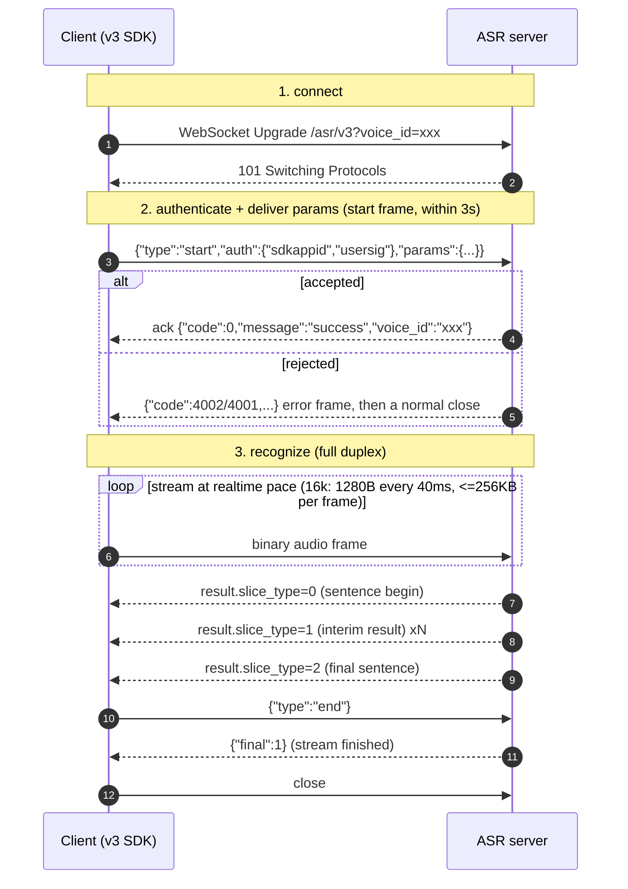

# TRTC-ASR Go SDK

Go SDK for Tencent TRTC speech recognition (ASR): realtime recognition (WebSocket), one-shot sentence recognition (HTTP) and asynchronous audio file recognition (HTTP).

This SDK targets the **v3 protocol**: only `SdkAppID` + `SecretKey` are required (no Tencent Cloud AppID), requests use separate `auth` / `params` blocks, everything is snake_case, and responses are flat with numeric codes. The v3 client lives in the `asr/v3` package.

> Other languages: [English](./README.en.md) | [中文](./README.md)
>
> SDKs: [Python](https://github.com/Tencent-RTC/trtc-asr-sdk-python) | [Node.js](https://github.com/Tencent-RTC/trtc-asr-sdk-nodejs) | [Java](https://github.com/Tencent-RTC/trtc-asr-sdk-java) | [Rust](https://github.com/Tencent-RTC/trtc-asr-sdk-rust) | [C++](https://github.com/Tencent-RTC/trtc-asr-sdk-cpp)
>
> The **legacy v2 / v1 protocol** (and its clients, exported from the `asr` package) is documented in [docs/v2_protocol.md](./docs/v2_protocol.md). Those clients stay fully supported; existing users do not need to change anything.

## Prerequisites

Two credentials are needed: `SdkAppID` and `SecretKey`. The domestic and international sites use different account systems — follow the official quick start for your site to register, create an application and activate the service:

- **China site**: [Quick Start](https://xai.cloud-rtc.com/#gettingStarted) — register a Tencent Cloud account and complete real-name verification → create an application in the [TRTC console](https://console.cloud.tencent.com/trtc/app) → activate "AI Speech Recognition" (free trial available)
- **International site**: [Quick Start](https://xai-intl.cloud-rtc.com/#gettingStarted) — register at [trtc.io](https://www.trtc.io) (a Tencentcloud account is created automatically, no real-name verification) → create an application at [console.trtc.io](https://console.trtc.io) → activate "AI Speech Recognition" (RTC Engine Lite or above only; Free Trial is not supported)

## Protocol (v3)

### Endpoints

| Mode | Path |
|------|------|
| Realtime (WebSocket) | `wss://{host}/asr/v3?voice_id=<voice_id>` |
| Sentence (one-shot) | `POST https://{host}/v3/transcribe` |
| Audio file (async) | `POST https://{host}/v3/create_transcription` |
| Task query | `POST https://{host}/v3/describe_transcription` |

`{host}` is `asr.cloud-rtc.com` (China) or `asr-intl.cloud-rtc.com` (international, `credential.SetSite(common.SiteIntl)`).

### Authentication and parameters (auth / params blocks)

v3 splits a request into two orthogonal blocks, all snake_case:

- `auth`: identity and signature, consumed by the gateway authentication layer — **realtime and HTTP carry different fields, see below**.
- `params`: recognition options (engine, VAD, hotwords, filters, …), named like the v2 realtime query parameters.

Both blocks share the same signature rules:

- Without `credential.SetUserSig()`, the SDK derives the signature locally from `SDKAppID + SecretKey`, valid for **86400 seconds**, and regenerates it for every connection / request — long-running services need no extra care.
- Once `credential.SetUserSig(sig)` sets a fixed signature, the SDK **neither generates nor refreshes it**. The server verifies it against the current identifier (`voice_id` for realtime, `request_id` for HTTP), so the signature must be issued with that same identifier; fixed-signature setups (e.g. a browser client receiving a signature from your backend) must handle expiry and identifier alignment themselves.
- The signature is bound to the site: `credential.SetSite(common.SiteIntl)` selects both the host and the verification cluster — do not mix China-site and international-site credentials.
- `SecretKey` never leaves your process; the signature is only used for server-side verification.

#### Realtime (streaming) authentication

One WebSocket connection is one stream; `voice_id` is both the stream identity and the signature identifier (it travels in the URL and in `params`, so the `auth` block does not repeat it).

| Field | Type | Required | Notes |
|-------|------|----------|-------|
| `sdkappid` | string | yes | TRTC application ID, taken from the credential and filled in by the SDK |
| `usersig` | string | yes | TRTC signature; identifier = the current `voice_id` (the SDK signs with that value) |

- **There is no `request_id` in realtime**: it belongs to the one-request-one-transaction HTTP interfaces (below).
- `voice_id` appears both in the URL (`?voice_id=`) and in `params.voice_id` (keep them equal, or omit the param); max 128 characters. The SDK generates a UUID by default and `SetVoiceID` overrides it; a conflict with a live stream returns `4001`.
- One stream carries one signature, issued per connection — a reconnect signs again, so there is no expiry to manage yourself.

Within **3 seconds** of the WebSocket handshake, send one start frame:

```json
{
  "type": "start",
  "auth": {"sdkappid": "1400000001", "usersig": "eJw..."},
  "params": {"engine_model_type": "16k_zh_en", "voice_format": 1, "needvad": 1}
}
```

On success the server replies `{"code":0,"message":"success","voice_id":"..."}`. After that, audio goes out as binary frames and the session ends with `{"type":"end"}`. The SDK's `Start()` **waits synchronously for this ack**, so authentication and parameter errors are returned from `Start()` itself.

#### HTTP authentication

Every HTTP request is an independent transaction; `request_id` is both the per-request ID and the signature identifier (the caller never has to generate one).

| Field | Type | Required | Notes |
|-------|------|----------|-------|
| `sdkappid` | string | yes | TRTC application ID, taken from the credential and filled in by the SDK |
| `usersig` | string | yes | TRTC signature; identifier = this request's `request_id` (the SDK signs with that value) |
| `request_id` | string | yes | Per-request ID, generated by the SDK (UUID) on every request; echoed in the response and carried back by `callback_url`, which makes it the key for reconciliation and troubleshooting (not customizable) |

The body is the symmetric `{"auth":{...},"params":{...}}` envelope and the response is flat (no `Response` wrapper):

```json
{"code": 0, "message": "success", "request_id": "req-uuid", "result": "transcript", "audio_duration": 1234}
```

> **Note**: an HTTP authentication failure arrives as **HTTP 200** with `{"code":4002}`. Always judge the outcome by the `code` in the body (the SDK does this: any non-zero code becomes an error carrying that code).

### Realtime flow (connect → authenticate → recognize)



> Mapping to the SDK: `Start()` = steps 1+2 (waits for the ack, fails fast); `Write()` = step 3 uplink; downlink frames reach you through the listener (`OnSentenceBegin` / `OnRecognitionResultChange` / `OnSentenceEnd` / `OnRecognitionComplete`); `Stop()` sends `end` and waits for `final:1`. Idle guard: the server closes with `4008` after 15s without audio.

### Start-frame parameters

`needvad`, `vad_silence_time`, `vad_level`, `input_sample_rate`, `convert_num_mode`, `filter_empty_result` and `noise_threshold` are tri-state: omitting them keeps the server default, while an explicit `0` is meaningful and is honored on v3 (the v2 query transport silently dropped explicit zeros).

| Field | Type | Default | Description |
|-------|------|---------|-------------|
| `voice_id` | string | from URL | Stream ID (<=128 chars); same as the URL or omitted |
| `engine_model_type` | string | `16k_zh_en` | Engine model |
| `language` | string | empty | Language hint (`zh`, `en`, `ja`, …); empty = auto detect |
| `voice_format` | int | `1` | Audio format: `1`pcm/`4`speex/`6`silk/`8`mp3/`10`opus/`11`ogg/`12`wav/`14`m4a/`16`aac |
| `input_sample_rate` | int | — | Only `8000`: declare 8k PCM input for a 16k engine |
| `needvad` | int | engine default | `0` off / `1` on |
| `vad_silence_time` | int | `800` | Sentence-final silence (ms); 240–2000 when `needvad=1` |
| `vad_level` | int | `1` | VAD profile: `0` high recall / `1` far-field filtering |
| `noise_threshold` | float | — | Noise threshold `0`–`4`; overrides `vad_level` when set |
| `max_speak_time` | int | `60000` | Forced sentence split (ms); 5000–90000 |
| `filter_dirty` | int | `0` | Profanity: `0` off / `1` filter / `2` replace with * |
| `filter_modal` | int | `0` | Modal particles: `0` off / `1` partial / `2` strict |
| `filter_punc` | int | `0` | Final punctuation: `0` off / `1` filter |
| `filter_empty_result` | int | `1` | Empty results: `0` deliver / `1` skip |
| `convert_num_mode` | int | `1` | Number conversion: `0` off / `1` smart / `3` math |
| `word_info` | int | `0` | Word timings: `0` off / `1` on / `2` with punctuation / `100` caption |
| `word_with_space` | int | `0` | Space-separated English words |
| `hotword_id` | string | empty | Hotword table ID (per SdkAppID) |
| `hotword_list` | string | empty | Inline hotwords: `word\|weight` comma-separated; word <=30 chars, weight 1–11 or 100 |
| `speaker_diarization` | int | `0` | Diarization: `0` off / `1` anonymous clustering / `3` voiceprint roles |
| `speaker_number` | int | `0` | Speaker count hint; `0` = auto detect |
| `voiceprint_ids` | []string | empty | Enrolled voiceprint IDs (only `speaker_diarization=3`) |
| `speaker_roles` | []object | empty | Temporary voiceprints: `[{"audio_url":"...","role_name":"..."}]` (only mode 3); `role_name` is echoed in results |
| `context` | object | empty | Recognition context: `{"text":"background","terms":["term"],"general":[{"key":"domain","value":"Meeting"}]}` |

> How `context` is consumed depends on the engine: LLM-class engines can use `text` / `terms` / `general`, while traditional engines degrade `terms` to hotwords and ignore the rest. With `speaker_diarization=1/3` the server forces VAD on and adjusts `word_info`.

### Realtime response

The downlink shape is identical to v2 (`code` / `message` / `voice_id` / `message_id` / `result` / `final`):

| Field | Type | Description |
|-------|------|-------------|
| `code` / `message` | Integer / String | Status code and text; `0` means success |
| `voice_id` / `message_id` | String | Stream ID / message ID |
| `final` | Integer | `1` marks the end-of-stream frame |
| `result.slice_type` | Integer | `0` sentence begin, `1` interim, `2` final sentence |
| `result.index` | Integer | Sentence index |
| `result.start_time` / `end_time` | Integer | Result time range (ms) |
| `result.voice_text_str` | String | Result text |
| `result.word_size` / `word_list` | Integer / Array | Word (character) timings, requires `word_info != 0` |
| `result.speaker_segments` | Array | Speaker segments, returned when diarization is on |
| `result.language` / `language_b47` | String | Detected language (when the engine reports it) |
| `result.finish_silence_ms` | Integer | Trailing silence that triggered the split (ms) |
| `result.last_token_runtime_ms` | Integer | Server-side decode time of the last token (ms) |

With diarization on, speaker attribution comes through `result.speaker_segments[]` (recommended) and `result.word_list[].speaker_id` (requires `word_info != 0`); `speaker_id` starts at 1, `-1` means unknown. `speaker_segments[]` carries `speaker_id`, `speaker_name` (mode 3 only), `start_time`, `end_time`, `text`, `word_start`, `word_end` and `stable_flag`.

### Sentence recognition /v3/transcribe

`params`:

| Field | Type | Required | Description |
|-------|------|----------|-------------|
| `engine_model_type` | string | yes | Engine model |
| `source_type` | int | yes | `0` URL / `1` local data (base64) |
| `voice_format` | string | yes | `wav`, `pcm`, `ogg-opus`, `mp3`, `m4a` |
| `url` | string | conditional | Audio URL (required when `source_type=0`) |
| `data` | string | conditional | Base64 audio (required when `source_type=1`) |
| `data_len` | int | conditional | Original audio length (required when `source_type=1`) |
| `word_info` | int | no | `0` off / `1` on / `2` with punctuation |
| `filter_dirty` / `filter_modal` / `filter_punc` | int | no | Filters |
| `convert_num_mode` | int | no | `0` off / `1` smart / `3` math |
| `hotword_id` / `hotword_list` | string | no | Hotwords |
| `customization_id` | string | no | Custom language model ID |
| `input_sample_rate` | int | no | PCM input sample rate (only 8000) |
| `needvad` / `vad_silence_time` | int | no | Tri-state; omitted means server default |
| `language` | string | no | Language hint; empty = auto detect |
| `speaker_diarization` / `speaker_number` | int | no | Diarization |
| `context` | object | no | Recognition context (same shape as realtime) |

**Limits**: audio <= 60s, file <= 3MB.

Response (`TranscribeResponse`): `code`, `message`, `request_id`, `result`, `audio_duration` (ms), `language`, `language_b47`, `word_size`, `word_list[]` (`word`, `start_time`, `end_time` in ms).

### Audio file recognition /v3/create_transcription

Asynchronous: creating a task returns a `transcription_id` (valid for 24 hours), which you then poll with the task query endpoint. Request fields: `engine_model_type`, `channel_num`, `res_text_format`, `source_type`, `url` (<=12h, <=1GB) or `data` + `data_len` (<=5MB), `audio_urls` (distributed recording: `[{"index":0,"url":"...","label":"..."}]`, requires `source_type=0` with `url`/`data` empty), `callback_url`, `speaker_diarization`, `speaker_number`, `voiceprint_ids`, `speaker_roles`, `hotword_id`, `hotword_list`, `customization_id`, `keyword_lib_id_list`, `replace_text_id`, `convert_num_mode`, `filter_dirty`/`filter_punc`/`filter_modal`, `sentence_max_length`, `extra`, `vad_silence_ms`, `vad_level`, `noise_threshold` (`0` is valid; use a pointer/`None` to mean "unset"), `language`, `context`.

Response: `{"code":0,"message":"success","request_id":"...","transcription_id":"..."}`.

When `callback_url` is set, the server POSTs the result as `application/x-www-form-urlencoded` once the task finishes, with `code`, `message`, `request_id` (the value from creation), `transcription_id`, `text`, `audio_duration` (seconds), `audio_url` and `result_detail` (JSON string).

### Task query /v3/describe_transcription

`params` has a single field: `transcription_id` (not interchangeable with the v1 `RecTaskId`).

Response (`TranscriptionStatus`): `code`, `message`, `request_id`, `transcription_id`, `status` (`0` queued / `1` running / `2` succeeded / `3` failed), `status_str`, `progress`, `audio_duration` (seconds), `result`, `result_detail[]`, `error_msg`.

`result_detail[]` (`SentenceDetail`): `final_sentence`, `slice_sentence`, `written_text`, `start_ms`, `end_ms`, `words_num`, `words[]` (`word`, `start_time`, `end_time`), `speech_speed`, `speaker_id`, `channel_id` (stereo: 1 = left, 2 = right), `speaker_role_name`, `silence_time`, `language`, `language_b47`.

### Error codes

| code | Meaning | Typical trigger |
|------|---------|-----------------|
| `4000` | Audio sent too fast | At most 3s of audio per 1s wall-clock |
| `4001` | Invalid parameter | params validation failed / `EnableV3Route` off / `voice_id` conflict |
| `4002` | Authentication failed | missing `auth` / bad `usersig` / querying another account's task |
| `4003` | Service not activated | scheduling refused |
| `4006` | Concurrency limit | account concurrency or connection limit |
| `4007` | Audio decode failed | audio does not match `voice_format` |
| `4008` | Timeout | no audio for 15s / start frame not sent within 3s |
| `4010` | Unknown text message | invalid start frame JSON or `type` other than `start` |
| `5000`/`5001`/`5002` | Server error | no worker available / scheduling failed; retryable |

HTTP status vs. `code`: invalid parameter `400`, authentication failure **`200`**, v3 not enabled `404`, concurrency `429`, body too large `413`, scheduling failure `503` — **always trust the `code` in the body**.

## Installation

```bash
go get github.com/Tencent-RTC/trtc-asr-sdk-go
```

## Quick start

### Realtime recognition

```go
package main

import (
	"log"

	"github.com/Tencent-RTC/trtc-asr-sdk-go/asr/v3"
)

type MyListener struct{ v3.UnimplementedSpeechRecognitionListener }

func (l *MyListener) OnSentenceEnd(resp *v3.SpeechRecognitionResponse) {
	log.Printf("Sentence end: %s", resp.Result.VoiceTextStr)
}
func (l *MyListener) OnFail(resp *v3.SpeechRecognitionResponse, err error) {
	log.Printf("Failed: %v", err) // *common.ASRError; Code is the server code
}

func main() {
	// First argument is the SdkAppID; v3 needs no Tencent Cloud AppID.
	credential := v3.NewCredential(1400000000, "your-sdk-secret-key")
	// credential.SetSite(common.SiteIntl)  // international site

	recognizer := v3.NewSpeechRecognizer(credential, "16k_zh_en", &MyListener{})

	// Start() waits synchronously for the server ack; auth/param errors return here.
	if err := recognizer.Start(); err != nil {
		log.Fatal(err)
	}
	// recognizer.Write(pcmChunk) ...  // loop over your audio
	recognizer.Stop() // sends {"type":"end"} and waits for final
}
```

### Sentence recognition

```go
recognizer := v3.NewSentenceRecognizer(credential)
data, _ := os.ReadFile("audio.pcm")
resp, err := recognizer.RecognizeData(data, "pcm", "16k_zh_en")
if err != nil {
	log.Fatal(err)
}
fmt.Println(resp.Result, resp.AudioDuration, resp.WordList)
```

### Audio file recognition

```go
recognizer := v3.NewFileRecognizer(credential)
taskID, err := recognizer.CreateTaskFromURL("https://example.com/audio.wav", "16k_zh_en")
if err != nil {
	log.Fatal(err)
}
status, err := recognizer.WaitForResult(taskID) // polls until finished
if err != nil {
	log.Fatal(err)
}
fmt.Println(status.Result, status.AudioDuration, status.ResultDetail)
```

## Credentials

| Field | China site | International site | Notes |
|-------|-----------|--------------------|-------|
| `SDKAppID` | [TRTC console](https://console.cloud.tencent.com/trtc/app) > Application management | [console.trtc.io](https://console.trtc.io) > application details | TRTC application ID |
| `SecretKey` | [TRTC console](https://console.cloud.tencent.com/trtc/app) > overview > SDK key | [console.trtc.io](https://console.trtc.io) > application details | Used to derive UserSig; never transmitted |

> The Tencent Cloud `AppID` needed by the v2 client is not required on v3.

## Configuration

Realtime recognition (`v3.SpeechRecognizer`); setters mirror the v2 client:

| Method | Description | Default |
|--------|-------------|---------|
| `SetVoiceFormat(f)` | Audio format | 1 (PCM) |
| `SetNeedVad(v)` | Enable VAD | 1 (on) |
| `SetConvertNumMode(m)` | Number conversion | 1 (smart) |
| `SetHotwordId(id)` / `SetHotwordList(list)` | Hotwords | - |
| `SetFilterDirty(m)` / `SetFilterModal(m)` / `SetFilterPunc(m)` | Filters | 0 (off) |
| `SetFilterEmptyResult(m)` | Deliver empty results | 1 (skip) |
| `SetWordInfo(m)` | Word/character timings | 0 (off) |
| `SetWordWithSpace(m)` | Space-separated English words | 0 (off) |
| `SetVadSilenceTime(ms)` | VAD silence threshold (240-2000) | 800ms |
| `SetVadLevel(level)` | VAD profile: 0 high recall / 1 far-field | 1 |
| `SetNoiseThreshold(v)` | VAD noise tuning (0.0-4.0), overrides the profile | unset |
| `SetMaxSpeakTime(ms)` | Forced split (5000-90000) | 60000ms |
| `SetInputSampleRate(r)` | PCM input rate, only 8000 | - |
| `SetSpeakerDiarization(m)` | Diarization: 0 off / 1 cluster / 3 voiceprint | 0 (off) |
| `SetSpeakerNumber(n)` | Speaker count hint | 0 (auto) |
| `SetSpeakerRoles(roles)` | Temporary voiceprints (mode 3) | - |
| `SetVoiceprintIds(ids)` | Enrolled voiceprint IDs (mode 3) | - |
| `SetLanguage(lang)` | Language hint | auto |
| `SetVoiceId(id)` | Custom voice_id | auto UUID |
| `SetContext(ctx)` | Recognition context | - |

## Engine models

| Value | Description |
|-------|-------------|
| `8k_zh` | Chinese, telephony |
| `16k_zh` | Chinese, general (recommended) |
| `16k_zh_en` | Chinese + English |
| `bigmodel` | Large model engine (multi-language) |

## Examples

- Realtime (v3): [`examples/v3_realtime_asr/`](./examples/v3_realtime_asr/)
- Sentence (v3): [`examples/v3_sentence_asr/`](./examples/v3_sentence_asr/)
- Audio file (v3): [`examples/v3_file_asr/`](./examples/v3_file_asr/)
- Realtime (v2): [`examples/realtime_asr/`](./examples/realtime_asr/)
- Sentence (v2): [`examples/sentence_asr/`](./examples/sentence_asr/)
- Audio file (v2): [`examples/file_asr/`](./examples/file_asr/)

```bash
cd examples/v3_realtime_asr
TRTC_ASR_SDK_APP_ID=... TRTC_ASR_SECRET_KEY=... go run main.go -f ../test.pcm -e bigmodel
```

## Project layout

```
trtc-asr-sdk-go/
├── common/                     # protocol-agnostic building blocks (shared)
│   ├── credential.go           # credentials (SDKAppID + SecretKey + AppID[v2])
│   ├── usersig.go              # TRTC UserSig generation
│   ├── signature.go            # v2 URL parameter construction
│   └── errors.go
├── asr/                        # v2/v1 clients
│   ├── speech_recognizer.go    # realtime client (WebSocket /asr/v2/{appid})
│   ├── sentence_recognizer.go  # sentence client (/v1/SentenceRecognition)
│   └── file_recognizer.go      # file client (/v1/CreateRecTask + DescribeTaskStatus)
├── asr/v3/                     # v3 protocol client
│   ├── types.go                # wire types (auth/params/flat responses, snake_case)
│   ├── params.go               # validation mirroring the server validator
│   ├── client.go               # shared HTTP path ({auth,params} + POST)
│   ├── speech_recognizer.go    # /asr/v3 start-frame protocol
│   ├── sentence_recognizer.go  # /v3/transcribe
│   └── file_recognizer.go      # /v3/create_transcription + describe
├── docs/v2_protocol.md         # legacy v2/v1 documentation
├── examples/
└── README.md
```

## FAQ

**v3 or v2?** For new integrations use v3 (`asr/v3`): only SdkAppID + SecretKey, a cleaner protocol, and `Start()` returns auth/parameter errors synchronously — provided `EnableV3Route` is enabled for your SdkAppID. Existing v2 users can stay as they are.

**Why `4001` / `404`?** Most likely the `EnableV3Route` switch is not enabled for your SdkAppID: the realtime endpoint answers `4001 v3 interface not enabled` and the HTTP endpoints answer `404`.

**Can I query a v1 task ID through v3?** No. The v1 `RecTaskId` and the v3 `transcription_id` are separate task spaces.

**How do I read error codes?** SDK-local codes are 10xx; server codes are 4xxx/5xxx. `ASRError.Code` ranges do not overlap.

## License

MIT License
