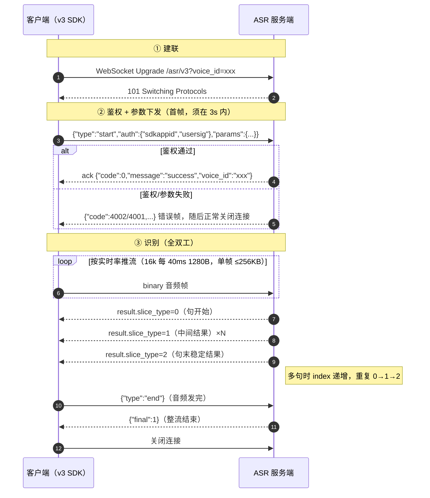
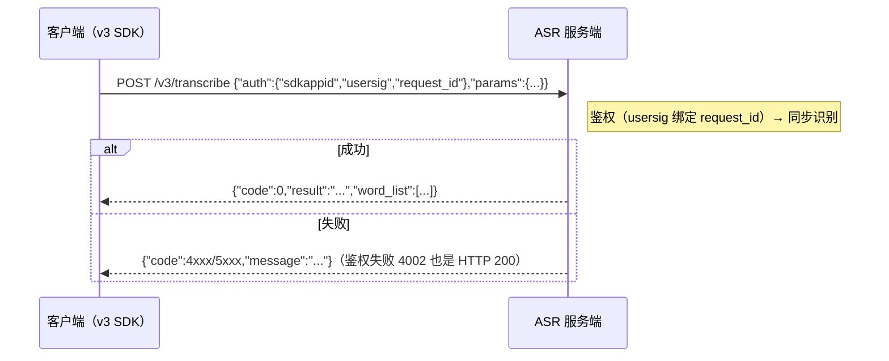
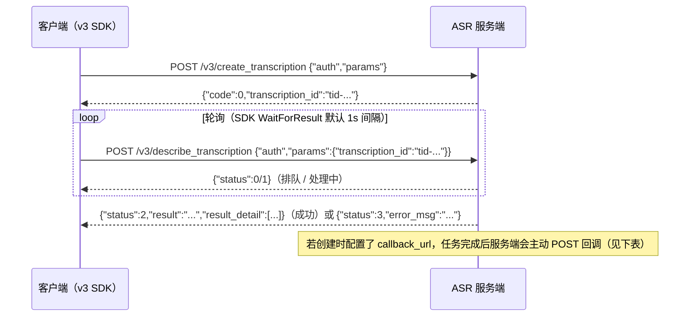

# TRTC-ASR Go SDK

> [English](./README.en.md) | 中文
基于 TRTC 鉴权体系的语音识别（ASR）Go SDK（**v3 协议**），支持实时语音识别（WebSocket）、一句话识别（HTTP）和录音文件识别（异步 HTTP）三种模式。

> 旧版 v2 / v1 协议客户端（`asr` 包）继续维护、存量可用，文档见 [docs/v2_protocol.md](./docs/v2_protocol.md)。

> 其他语言 SDK：[Python](https://github.com/Tencent-RTC/trtc-asr-sdk-python) | [Node.js](https://github.com/Tencent-RTC/trtc-asr-sdk-nodejs) | [Java](https://github.com/Tencent-RTC/trtc-asr-sdk-java) | [Rust](https://github.com/Tencent-RTC/trtc-asr-sdk-rust) | [C++](https://github.com/Tencent-RTC/trtc-asr-sdk-cpp)

## 前提条件

使用本 SDK 前，您需要准备两个凭证：`SDKAppID`、`SecretKey`（v3 协议以 SDKAppID 为唯一客户维度，**不再需要腾讯云 AppID**）。国内站与国际站的账号体系不同，请按您的站点参照官方快速接入指南完成注册、创建应用与服务开通：

- **国内站**：[快速接入指南](https://xai.cloud-rtc.com/#gettingStarted) — 注册腾讯云账号并完成实名认证 → 在 [TRTC 控制台](https://console.cloud.tencent.com/trtc/app)创建应用 → 开通「AI 智能识别」（体验版可免费试用）
- **国际站**：[Quick Start](https://xai-intl.cloud-rtc.com/#gettingStarted) — 在 [trtc.io](https://www.trtc.io) 注册（自动开通 Tencentcloud 账号，无需实名认证）→ 在 [console.trtc.io](https://console.trtc.io) 创建应用 → 开通「AI Speech Recognition」（仅 RTC Engine Lite 及以上包月套餐，Free Trial 不支持）

## 协议说明

### 接口路径

| 模式 | 路径 |
|------|------|
| 实时识别（WebSocket） | `wss://{host}/asr/v3?voice_id=<voice_id>` |
| 一句话识别 | `POST https://{host}/v3/transcribe` |
| 录音文件识别 | `POST https://{host}/v3/create_transcription` |
| 任务查询 | `POST https://{host}/v3/describe_transcription` |

`{host}` 国内站为 `asr.cloud-rtc.com`，国际站为 `asr-intl.cloud-rtc.com`（`credential.SetSite(common.SiteIntl)`）。

### 鉴权与参数（auth / params 分块）

v3 把请求拆成两个正交的块，字段全程 snake_case：

- `auth`：身份与签名 —— `sdkappid`（string）、`usersig`（TRTC 签名，identifier 在线 = `voice_id`、离线 = `request_id`）、`request_id`（离线，SDK 自动生成 uuid）。
- `params`：业务识别参数（引擎、VAD、热词、过滤等），snake_case。

在线：WebSocket 建连后 **3 秒内**发送首帧 JSON：

```json
{
  "type": "start",
  "auth": {"sdkappid": "1400000001", "usersig": "eJw..."},
  "params": {"engine_model_type": "16k_zh_en", "voice_format": 1, "needvad": 1}
}
```

鉴权通过后服务端回 `{"code":0,"message":"success","voice_id":"..."}`，之后上行 binary 音频帧、
结束发 `{"type":"end"}`。SDK 的 `Start()` 会**同步等待这个 ack**，鉴权/参数错误直接从 `Start()` 返回。

离线：HTTP POST body 为对称的 `{"auth":{...},"params":{...}}`，响应扁平化（无 `Response` 外壳）：

```json
{"code": 0, "message": "success", "request_id": "req-uuid", "result": "识别文本", "audio_duration": 1234}
```

> **注意**：v3 离线鉴权失败是 HTTP 200 + `{"code":4002}`，判断结果请以 body 的 `code` 为准
> （SDK 已处理，`code != 0` 会返回携带该 code 的 error）。

### 在线交互流程（建联 → 鉴权 → 识别）



> SDK 行为对应关系：`Start()` = ①+②（同步等 ack，失败立即返回 error）；`Write()` = ③上行；
> 下行经 listener 回调（`OnSentenceBegin` / `OnRecognitionResultChange` / `OnSentenceEnd` /
> `OnRecognitionComplete`）；`Stop()` = 发 `end` 并等 `final:1`。
> 空闲保护：15s 未发音频服务端会以 `4008` 断连。

### 在线首帧参数（params）

`needvad` / `vad_silence_time` / `vad_level` / `input_sample_rate` / `convert_num_mode` /
`filter_empty_result` / `noise_threshold` 为可选三态字段：未传走服务端缺省，显式传 `0` 有业务含义
（`vad_silence_time`、`input_sample_rate` 显式传 `0` 非法）。

| 参数 | 类型 | 默认 | 说明 |
|------|------|------|------|
| `voice_id` | string | 取 URL | 流唯一标识（≤128 字符），与 URL 一致或省略 |
| `engine_model_type` | string | `16k_zh_en` | 引擎模型 |
| `language` | string | 空 | 识别语言（`zh`/`en`/`ja`…），空=自动检测 |
| `voice_format` | int | `1` | 音频格式：`1`pcm/`4`speex/`6`silk/`8`mp3/`10`opus/`11`ogg/`12`wav/`14`m4a/`16`aac |
| `input_sample_rate` | int | 不传 | 仅 `8000`：声明 8k PCM 输入，配 16k 引擎升采样 |
| `needvad` | int | 引擎相关 | `0` 关 / `1` 开 VAD |
| `vad_silence_time` | int | `800` | 断句静音阈值（ms），`needvad=1` 时范围 240~2000 |
| `vad_level` | int | `1` | VAD 场景档：`0` 高召回 / `1` 远场过滤 |
| `noise_threshold` | float | 不传 | 噪声阈值 `0`~`4`，设置后覆盖 `vad_level` 档 |
| `max_speak_time` | int | `60000` | 强制断句时长（ms），范围 5000~90000 |
| `filter_dirty` | int | `0` | 脏词：`0` 不过滤 / `1` 过滤 / `2` 替换为 * |
| `filter_modal` | int | `0` | 语气词：`0` 不过滤 / `1` 部分 / `2` 严格 |
| `filter_punc` | int | `0` | 句末标点：`0` 不过滤 / `1` 过滤 |
| `filter_empty_result` | int | `1` | 空结果：`0` 下发 / `1` 不下发 |
| `convert_num_mode` | int | `1` | 数字转换：`0` 不转 / `1` 智能 / `3` 数学 |
| `word_info` | int | `0` | 词级时间戳：`0` 关 / `1` 开 / `2` 含标点 / `100` 字幕模式 |
| `word_with_space` | int | `0` | 英文单词间空格输出 |
| `hotword_id` | string | 空 | 热词表 ID（SDKAppID 维度） |
| `hotword_list` | string | 空 | 临时热词：`词\|权重` 逗号分隔，词 ≤30 字符，权重 1~11 或 100 |
| `speaker_diarization` | int | `0` | 说话人分离：`0` 关 / `1` 匿名聚类 / `3` 声纹角色认证 |
| `speaker_number` | int | `0` | 说话人数量提示，`0` 自动检测 |
| `voiceprint_ids` | []string | 空 | 已注册声纹 ID（仅 `speaker_diarization=3`） |
| `speaker_roles` | []object | 空 | 临时声纹：`[{"audio_url":"...","role_name":"..."}]`（仅模式 3），`role_name` 会回显到结果 |
| `context` | object | 空 | 识别上下文：`{"text":"背景文本","terms":["术语"],"general":[{"key":"domain","value":"Meeting"}]}` |

> `context` 消费方式与引擎能力相关：大模型类引擎可用 `text`/`terms`/`general`，传统引擎仅把
> `terms` 降级为热词。`speaker_diarization=1/3` 时服务端会强制开启 VAD 并调整 `word_info`。

### 在线响应

下行消息结构（`code` / `message` / `voice_id` / `message_id` / `result` / `final`）：

| 字段 | 类型 | 说明 |
|------|------|------|
| `code` / `message` | Integer / String | 错误码与提示，`0` 表示成功 |
| `voice_id` / `message_id` | String | 音频流 ID / 单条消息 ID |
| `final` | Integer | `1` 表示会话结束包 |
| `result.slice_type` | Integer | `0` 句子开始，`1` 中间结果，`2` 句末稳定结果 |
| `result.index` | Integer | 句子序号 |
| `result.start_time` / `end_time` | Integer | 当前结果起止时间（ms） |
| `result.voice_text_str` | String | 当前结果文本 |
| `result.word_size` / `word_list` | Integer / Array | 词级（字级）时间戳，需 `word_info != 0` |
| `result.speaker_segments` | Array | 说话人分段，开启说话人分离后返回 |
| `result.language` | String | 识别语言（引擎上报时） |
| `result.finish_silence_ms` | Integer | 触发断句的尾部静音时长（ms） |
| `result.last_token_runtime_ms` | Integer | 末字服务端解码耗时（ms） |

### 一句话识别 /v3/transcribe



`params` 字段：

| 参数 | 类型 | 必填 | 说明 |
|------|------|------|------|
| `engine_model_type` | string | 是 | 引擎模型 |
| `source_type` | int | 是 | `0` URL 上传 / `1` 本地数据（base64） |
| `voice_format` | string | 是 | 音频格式：`wav`、`pcm`、`ogg-opus`、`mp3`、`m4a` |
| `url` | string | 条件 | 音频 URL（`source_type=0` 必填） |
| `data` | string | 条件 | base64 音频数据（`source_type=1` 必填） |
| `data_len` | int | 条件 | 音频数据原始长度（`source_type=1` 必填） |
| `word_info` | int | 否 | 词级时间：`0` 关 / `1` 开 / `2` 含标点 |
| `filter_dirty` | int | 否 | 脏词过滤：`0` / `1` / `2`(替换 *) |
| `filter_modal` | int | 否 | 语气词过滤：`0` / `1` / `2` |
| `filter_punc` | int | 否 | 标点过滤：`0` 不过滤 / `1` 过滤 |
| `convert_num_mode` | int | 否 | 数字转换：`0` 不转 / `1` 智能 / `3` 数学 |
| `hotword_id` | string | 否 | 热词表 ID |
| `customization_id` | string | 否 | 自学习模型 ID |
| `hotword_list` | string | 否 | 临时热词列表 |
| `input_sample_rate` | int | 否 | PCM 输入采样率（仅 8000，配 16k 引擎升采样） |
| `needvad` | int | 否 | 三态：不传走默认，`0` 关 / `1` 开 |
| `vad_silence_time` | int | 否 | 三态：不传走默认（800），断句静音阈值（ms） |
| `language` | string | 否 | 指定识别语言，留空自动检测 |
| `speaker_diarization` | int | 否 | 说话人分离：`0` 关 / `1` 聚类 / `3` 声纹角色 |
| `speaker_number` | int | 否 | 说话人数量提示，`0` 自动 |
| `context` | object | 否 | 识别上下文（结构同在线） |

**限制**：音频时长 ≤ 60s，文件大小 ≤ 3MB。

响应（`v3.TranscribeResponse`）：

| 字段 | 类型 | 说明 |
|------|------|------|
| `code` / `message` / `request_id` | int / string / string | 状态码 / 提示 / 请求 ID |
| `result` | string | 识别结果文本 |
| `audio_duration` | int | 音频时长（ms） |
| `language` / `language_b47` | string | 识别语言 |
| `word_size` / `word_list` | int / array | 词级结果，`word_list[]` 含 `word` / `start_time` / `end_time`（ms） |

### 录音文件识别 /v3/create_transcription

异步任务：创建返回 `transcription_id`（24 小时有效），再用任务查询接口轮询。




`params` 字段：

| 参数 | 类型 | 必填 | 说明 |
|------|------|------|------|
| `engine_model_type` | string | 是 | 引擎模型 |
| `channel_num` | int | 是 | 声道数：`1` 单声道；`2` 双声道（按 `channel_id` 出句，勿与分离同开） |
| `res_text_format` | int | 是 | 结果格式：`0` 基础 / `1` 含词级时间 / `2` 含标点时间 |
| `source_type` | int | 是 | `0` URL 上传 / `1` 本地数据（base64） |
| `url` | string | 条件 | 音频 URL（`source_type=0`，时长 ≤12h，大小 ≤1GB） |
| `data` / `data_len` | string / int | 条件 | base64 音频与原始长度（`source_type=1`，≤5MB） |
| `audio_urls` | array | 否 | 分布式录音：`[{"index":0,"url":"...","label":"..."}]` |
| `callback_url` | string | 否 | 结果回调 URL（任务完成后 POST） |
| `speaker_diarization` | int | 否 | 说话人分离：`0` 关 / `1` 聚类 / `3` 声纹角色 |
| `speaker_number` | int | 否 | 说话人数量提示 |
| `voiceprint_ids` | array | 否 | 已注册声纹 ID（仅模式 3） |
| `speaker_roles` | array | 否 | 临时声纹 `[{"audio_url","role_name"}]`（仅模式 3） |
| `hotword_id` | string | 否 | 热词表 ID |
| `customization_id` | string | 否 | 自学习模型 ID |
| `hotword_list` | string | 否 | 临时热词列表 |
| `keyword_lib_id_list` | array | 否 | 关键词库 ID 列表 |
| `replace_text_id` | string | 否 | 替换词表 ID |
| `convert_num_mode` | int | 否 | 数字转换 |
| `filter_dirty` / `filter_punc` / `filter_modal` | int | 否 | 过滤类 |
| `sentence_max_length` | int | 否 | 单句最大长度 |
| `extra` | string | 否 | 引擎扩展串 |
| `vad_silence_ms` | int | 否 | 静音断句阈值（ms） |
| `vad_level` | int | 否 | VAD 场景档：`0` 高召回 / `1` 远场过滤 |
| `noise_threshold` | float | 否 | 噪声阈值 `0`~`4`（`0` 是合法取值，Go 里用 `*float64` 区分未设置） |
| `language` | string | 否 | 指定识别语言，留空自动检测 |
| `context` | object | 否 | 识别上下文（结构同在线） |

响应：`{"code":0,"message":"success","request_id":"...","transcription_id":"..."}`。

`callback_url` 回调（`application/x-www-form-urlencoded`，snake_case 字段）：

| 字段 | 说明 |
|------|------|
| `code` / `message` | `0` 成功 / 失败原因 |
| `request_id` | 创建时 `auth.request_id` 原值 |
| `transcription_id` | 任务 ID |
| `text` / `audio_duration` | 成功时：全文 / 时长（秒） |
| `audio_url` | 音频地址（存在且允许回传时） |
| `result_detail` | JSON 字符串，分句结构同任务查询响应 |

### 任务查询 /v3/describe_transcription

`params` 仅一个字段：`transcription_id`（创建任务返回的 ID；与 v1 `RecTaskId` 不通用）。

响应（`v3.TranscriptionStatus`）：

| 字段 | 类型 | 说明 |
|------|------|------|
| `code` / `message` / `request_id` | — | 状态码 / 提示 / 请求 ID |
| `transcription_id` | string | 任务 ID |
| `status` / `status_str` | int / string | `0` 排队 / `1` 处理中 / `2` 成功 / `3` 失败 |
| `progress` | int | 处理进度（0-100） |
| `audio_duration` | float | 音频时长（秒） |
| `result` | string | 完整识别文本 |
| `result_detail` | array | 分句结果（见下） |
| `error_msg` | string | 失败原因 |

`result_detail[]`（`v3.SentenceDetail`）：

| 字段 | 类型 | 说明 |
|------|------|------|
| `final_sentence` / `slice_sentence` / `written_text` | string | 终稿句 / 分片句 / 书面文本 |
| `start_ms` / `end_ms` | int | 句起止时间（ms） |
| `words_num` / `words` | int / array | 词级结果；`words[]` 含 `word` / `start_time` / `end_time` |
| `speech_speed` | float | 语速 |
| `speaker_id` | int | 说话人编号（开启分离后返回） |
| `channel_id` | int | 双声道场景声道编号：1=左、2=右 |
| `speaker_role_name` | string | 角色名（模式 3 命中声纹时返回） |
| `silence_time` | int | 句前静音（ms） |
| `language` / `language_b47` | string | 该句识别语言 |

### 错误码

| code | 说明 | 常见触发 |
|------|------|----------|
| `4000` | 音频发送过多 | 1 秒内最多发送 3 秒音频 |
| `4001` | 参数不合法 | params 校验失败 / `voice_id` 冲突 |
| `4002` | 鉴权失败 | `auth` 缺失 / `usersig` 验签不通过 / 查询他人任务 |
| `4003` | 服务未开通 | 调度拒绝 |
| `4006` | 并发超限 | 账号并发或连接数超限 |
| `4007` | 音频解码失败 | 音频与 `voice_format` 不符 |
| `4008` | 超时 | 在线 15s 未发音频 / 首帧 3s 超时 |
| `4010` | 未知文本消息 | 首帧 JSON 非法 / `type` 非 `start` |
| `5000`/`5001`/`5002` | 服务端内部错误 | 无可用机器 / 调度失败，可重试 |

离线接口的 HTTP 状态码与 `code` 组合：参数错误 `400`、鉴权失败 **`200`**、
并发超限 `429`、body 过大 `413`、调度失败 `503`——**一律以 body 的 `code` 为准**。

### 说话人分离（实时）

开启 `speaker_diarization` 后，说话人归属通过两个入口返回：

- `result.speaker_segments[]`：**推荐入口**。一个 `result` 可能包含多个说话人，句子级归属天然有歧义，因此协议按说话人切段返回。`len(speaker_segments) == 1` 即为单说话人句。
- `result.word_list[].speaker_id`：字级归属，需同时设置 `word_info != 0`。

`speaker_id` 语义：会话内有效，从 `1` 开始编号，`-1` 表示未知，`0` 为保留值。

`speaker_segments[]` 字段：

| 字段 | 类型 | 说明 |
|------|------|------|
| `speaker_id` | Integer | 说话人编号 |
| `speaker_name` | String | 角色名，仅 `speaker_diarization=3` 命中注册声纹时返回，等于请求侧 `RoleName` |
| `start_time` / `end_time` | Integer | 该分段起止时间（ms） |
| `text` | String | 该分段文本 |
| `word_start` / `word_end` | Integer | 对应 `word_list` 的闭区间下标，即 `word_list[word_start:word_end+1]`；`word_info=0` 时不返回 |
| `stable_flag` | Integer | 该分段是否稳定：`1` 稳定，`0` 非稳定 |

Go 用法示例：

```go
recognizer := v3.NewSpeechRecognizer(credential, "16k_zh_en", &MyListener{})
recognizer.SetWordInfo(1)                                         // 需要字级说话人时开启
recognizer.SetSpeakerDiarization(v3.SpeakerDiarizationCluster)     // 1：匿名聚类

// 声纹角色认证（返回角色名）：
// recognizer.SetSpeakerDiarization(v3.SpeakerDiarizationVoiceprint) // 3
// recognizer.SetSpeakerRoles([]v3.SpeakerRole{
//     {RoleName: "teacher", AudioURL: "https://example.com/teacher.wav"},
// })
// recognizer.SetVoiceprintIDs([]string{"vp-1"}) // 已注册声纹
// recognizer.SetSpeakerNumber(2)                // 0 = 自动检测；两种分离模式都生效

// 回调里读取：
func (l *MyListener) OnSentenceEnd(resp *v3.SpeechRecognitionResponse) {
    for _, seg := range resp.Result.SpeakerSegments {
        name := seg.SpeakerName            // speaker_diarization=3 才有
        if name == "" {
            name = fmt.Sprintf("spk%d", seg.SpeakerID)
        }
        log.Printf("[%s] %s", name, seg.Text)
    }
}
```

### VAD 调优（noise_threshold / vad_level）

| 方法 | 取值 | 说明 |
|------|------|------|
| `SetVadLevel(level)` | `0` / `1` | `0` 高召回，`1` 远场过滤（服务端默认） |
| `SetNoiseThreshold(v)` | `0.0` - `4.0` | 噪声抑制微调，值越大抑制越强、召回越低；设置后覆盖 `vad_level` 档位 |
| `SetVadSilenceTime(ms)` | 240 - 2000 | 静音断句阈值 |

两者都是三态语义：**只有显式调用 setter 才会下发**，因此显式传 `0` 与「不配置」可以区分（服务端 `vad_level` 默认是 `1`）。超出范围会在 `Start()` 阶段本地报错，不会浪费一次连接。

## 安装

```bash
go get github.com/Tencent-RTC/trtc-asr-sdk-go@latest
```

**要求**：Go 1.21+

## 快速开始

v3 客户端在 `asr/v3` 包中：

```go
import (
    v3 "github.com/Tencent-RTC/trtc-asr-sdk-go/asr/v3"
    "github.com/Tencent-RTC/trtc-asr-sdk-go/common"
)

// 第一个参数是 SDKAppID（如 1400xxxxxx）；v3 不需要腾讯云 AppID。
credential := v3.NewCredential(sdkAppID, "your-sdk-secret-key")
// credential.SetSite(common.SiteIntl) // 国际站；不调用则走国内站
```

### 实时语音识别

`Start()` 同步等服务端 ack，鉴权/参数错误立即返回：

```go
type MyListener struct{ v3.UnimplementedSpeechRecognitionListener }

func (l *MyListener) OnSentenceEnd(resp *v3.SpeechRecognitionResponse) {
    log.Printf("Sentence end: %s", resp.Result.VoiceTextStr)
}
func (l *MyListener) OnFail(resp *v3.SpeechRecognitionResponse, err error) {
    log.Printf("Failed: %v", err) // err 为 *common.ASRError，Code 即服务端错误码（4001/4002/...）
}

recognizer := v3.NewSpeechRecognizer(credential, "16k_zh_en", &MyListener{})
if err := recognizer.Start(); err != nil {
    log.Fatal(err) // 鉴权失败/参数非法在这里同步返回
}
// recognizer.Write(pcmChunk) ... 循环发送音频
recognizer.Stop() // 发送 {"type":"end"} 并等待 final
```

### 一句话识别

`POST /v3/transcribe`，请求/响应均为 snake_case 扁平结构：

```go
recognizer := v3.NewSentenceRecognizer(credential)
data, _ := os.ReadFile("audio.pcm")
resp, err := recognizer.RecognizeData(data, "pcm", "16k_zh_en")
if err != nil {
    log.Fatal(err)
}
fmt.Println(resp.Result, resp.AudioDuration, resp.WordList)
```

### 录音文件识别

`create_transcription` + `describe_transcription`，任务 ID 为 `transcription_id`，24 小时有效：

```go
recognizer := v3.NewFileRecognizer(credential)
taskID, err := recognizer.CreateTaskFromURL("https://example.com/audio.wav", "16k_zh_en")
if err != nil {
    log.Fatal(err)
}
status, err := recognizer.WaitForResult(taskID) // 轮询直至完成
if err != nil {
    log.Fatal(err)
}
fmt.Println(status.Result, status.AudioDuration, status.ResultDetail)
```

## 凭证获取

| 参数 | 国内站 | 国际站 | 说明 |
|------|--------|--------|------|
| `SDKAppID` | [TRTC 控制台](https://console.cloud.tencent.com/trtc/app) > 应用管理 | [console.trtc.io](https://console.trtc.io) > 应用详情 | TRTC 应用 ID，v3 唯一客户维度 |
| `SecretKey` | [TRTC 控制台](https://console.cloud.tencent.com/trtc/app) > 应用概览 > SDK密钥 | [console.trtc.io](https://console.trtc.io) > 应用详情 | 用于生成 UserSig，不会传输到网络 |

> v2 旧版协议还需要腾讯云 `AppID`，见 [docs/v2_protocol.md](./docs/v2_protocol.md)。

## 配置项

实时语音识别（`v3.SpeechRecognizer`）：

| 方法 | 说明 | 默认值 |
|------|------|--------|
| `SetVoiceFormat(f)` | 音频格式 | 1 (PCM) |
| `SetNeedVad(v)` | 是否开启 VAD（显式 `0` 会真正下发关闭） | 1 (开启) |
| `SetConvertNumMode(m)` | 数字转换模式：`0` 不转 / `1` 智能 / `3` 数学（显式 `0` 生效） | 1 (智能) |
| `SetHotwordID(id)` | 热词表 ID（SDKAppID 维度） | - |
| `SetHotwordList(list)` | 临时热词列表 `词\|权重,...` | - |
| `SetFilterDirty(m)` | 脏词过滤 | 0 (关闭) |
| `SetFilterModal(m)` | 语气词过滤 | 0 (关闭) |
| `SetFilterPunc(m)` | 句号过滤 | 0 (关闭) |
| `SetFilterEmptyResult(m)` | 空结果是否回调 | 1 (不回调) |
| `SetWordInfo(m)` | 词级/字级时间：`0` 关 / `1` 开 / `2` 含标点 / `100` 字幕 | 0 (关闭) |
| `SetWordWithSpace(m)` | 英文单词间空格输出 | 0 (关闭) |
| `SetVadSilenceTime(ms)` | VAD 静音阈值（240-2000） | 800ms |
| `SetVadLevel(level)` | VAD 场景档：0 高召回 / 1 远场过滤 | 1 |
| `SetNoiseThreshold(v)` | VAD 噪声微调（0.0-4.0），覆盖场景档 | 未设置 |
| `SetMaxSpeakTime(ms)` | 强制断句时间（5000-90000） | 60000ms |
| `SetInputSampleRate(r)` | 输入 PCM 采样率，仅 8000 | - |
| `SetSpeakerDiarization(m)` | 说话人分离：0 关 / 1 聚类 / 3 声纹角色 | 0 (关闭) |
| `SetSpeakerNumber(n)` | 说话人数量提示（分离开启时生效） | 0 (自动) |
| `SetSpeakerRoles(roles)` | 临时声纹角色 `{RoleName, AudioURL}`（仅模式 3） | - |
| `SetVoiceprintIDs(ids)` | 已注册声纹 ID（仅模式 3） | - |
| `SetLanguage(lang)` | 指定识别语言 | 自动检测 |
| `SetContext(ctx)` | 识别上下文（`text`/`terms`/`general`） | - |
| `SetVoiceID(id)` | 自定义 voice_id（UserSig 自动绑定该值） | 自动 UUID |

## 引擎模型

| 类型 | 说明 |
|------|------|
| `8k_zh` | 中文通用，常用于电话场景 |
| `16k_zh` | 中文通用（推荐） |
| `16k_zh_en` | 中英文通用 |

## 示例

- **实时语音识别**：[`examples/v3_realtime_asr/`](./examples/v3_realtime_asr/) — v3 首帧协议
- **一句话识别**：[`examples/v3_sentence_asr/`](./examples/v3_sentence_asr/) — `POST /v3/transcribe`
- **录音文件识别**：[`examples/v3_file_asr/`](./examples/v3_file_asr/) — 异步任务 + 轮询

```bash
cd examples/v3_realtime_asr
go run main.go -f ../test.pcm

# 说话人分离（匿名聚类 + 字级说话人）
go run main.go -f ../test.pcm -diarization 1 -word-info 1

# 说话人分离（声纹角色认证，返回角色名）
go run main.go -f ../test.pcm -diarization 3 \
  -roles "teacher=https://example.com/teacher.wav,student=https://example.com/student.wav"

# 查看所有选项
go run main.go -h

# 一句话识别
cd ../v3_sentence_asr && go run main.go -f ../test.pcm -word-info 1

# 录音文件识别（URL / 本地文件 + 说话人分离）
cd ../v3_file_asr
go run main.go -u https://example.com/audio.wav -diarization 1
```

> v2 旧版示例（realtime_asr / sentence_asr / file_asr）见 [docs/v2_protocol.md](./docs/v2_protocol.md#示例)。

## 项目结构

```
trtc-asr-sdk-go/
├── common/                     # 公共模块（v2/v3 共用）
│   ├── credential.go           # 凭证管理（SDKAppID + SDK密钥 + AppID[v2]）
│   ├── usersig.go              # TRTC UserSig 生成
│   ├── usersig_test.go         # UserSig 单元测试
│   ├── signature.go            # v2 URL 请求参数构建
│   ├── signature_test.go       # 参数构建单元测试
│   ├── signature_speaker_test.go # 说话人分离 / VAD 调优参数单元测试
│   └── errors.go               # 错误定义
├── asr/                        # v2 / v1 客户端（存量形态，见 docs/v2_protocol.md）
│   ├── speech_recognizer.go    # 实时语音识别器（WebSocket /asr/v2/{appid}）
│   ├── params.go               # 说话人分离 / VAD 调优参数校验
│   ├── sentence_recognizer.go  # 一句话识别器（/v1/SentenceRecognition）
│   ├── file_recognizer.go      # 录音文件识别器（/v1/CreateRecTask + DescribeTaskStatus）
│   └── *_test.go               # 单元测试
├── asr/v3/                     # v3 协议客户端（独立实现，不依赖 asr 包）
│   ├── doc.go                  # 包文档（协议速览）
│   ├── types.go                # wire 类型（auth/params/扁平响应，全 snake_case）
│   ├── params.go               # 参数校验（与 v3 服务端 validator 对齐）
│   ├── client.go               # 离线 HTTP 公共链路（{auth,params} 封装 + POST）
│   ├── speech_recognizer.go    # 实时语音识别器（/asr/v3 首帧协议）
│   ├── sentence_recognizer.go  # 一句话识别器（/v3/transcribe）
│   ├── file_recognizer.go      # 录音文件识别器（/v3/create_transcription + describe）
│   └── *_test.go               # mock server 端到端 wire 测试
├── docs/
│   └── v2_protocol.md           # v2 / v1 旧版协议与客户端文档
├── examples/                   # 示例代码
│   ├── test.pcm                # 测试音频文件（16kHz 16bit 单声道 PCM）
│   ├── v3_realtime_asr/        # v3 实时语音识别示例
│   │   └── main.go
│   ├── realtime_asr/           # v2 实时语音识别示例
│   │   └── main.go
│   ├── sentence_asr/           # v2 一句话识别示例
│   │   └── main.go
│   └── file_asr/               # v2 录音文件识别示例
│       └── main.go
├── go.mod                      # Go module 配置
├── go.sum                      # 依赖校验
├── .gitignore
└── README.md
```

## 常见问题

### 错误码怎么看？

v3 全部使用数字错误码：参数非法 `4001`、鉴权失败 `4002`、并发超限 `4006`、超时 `4008`、服务端错误 `5000`。
SDK 返回的 error 是 `*common.ASRError`，其 `Code` 即服务端错误码（SDK 本地错误用 10xx 区间，如
`1001` 本地参数错误、`1002` 连接失败）。注意离线接口鉴权失败也是 HTTP 200，请以 body 的 `code` 为准（SDK 已处理）。

### v1 的任务 ID 能用 v3 接口查询吗？

不能。v1 `RecTaskId` 与 v3 `transcription_id` 是两套任务空间，互不通用。

### 旧版 v2 / v1 协议在哪？

`asr` 包继续维护，文档见 [docs/v2_protocol.md](./docs/v2_protocol.md)。v2 与 v3 的下行消息结构一致，
listener 用法相同，切换协议版本只需改 import 与构造方式。

### UserSig 是什么？

UserSig 是基于 SDKAppID 和 SDK 密钥计算的签名，用于 TRTC 服务鉴权。SDK 会自动生成（identifier 在线绑定
`voice_id`、离线绑定 `request_id`），无需手动计算。详见[鉴权文档](https://cloud.tencent.com/document/product/647/17275)。

### 支持哪些音频格式？

- **实时语音识别**：支持 PCM 格式（`voice_format=1`），建议 16kHz、16bit、单声道
- **一句话识别**：支持 wav、pcm、ogg-opus、mp3、m4a，音频时长 ≤ 60s，文件 ≤ 3MB
- **录音文件识别**：支持 wav、ogg-opus、mp3、m4a，本地文件 ≤ 5MB，URL ≤ 1GB / ≤ 12h

## License

MIT License
